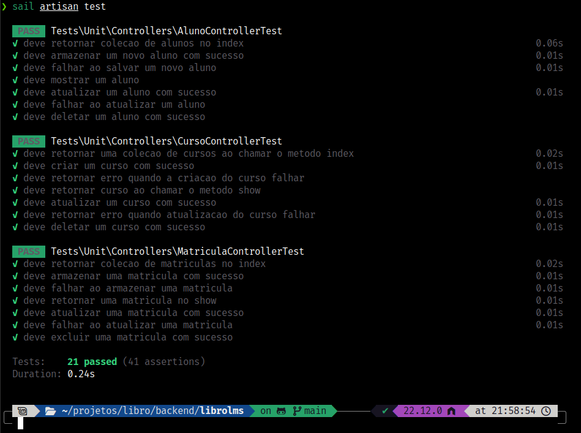

# API Libro LMS 

Esta API foi desenvolvida utilizando as seguintes tecnologias:

- Docker
- PHP 8.4
- Laravel 11 
- Mysql 8.0
- Dbeaver Community

Todo o desenvolvimento foi feito com sail que é uma simplificação dos comandos
docker, sendo assim, espera-se que você tenha o docker configurado em seu computador.

## Instalação:

### Faça clone do projeto:
```bash
git clone git@github.com:andrescherrer/librolms.git lms
```

### Acesse a pasta do projeto:
```bash
cd lsm
```
### Crie o arquivo .env
```bash
cp .env.example .env
```

### Credenciais para acesso ao banco de dados:
Consulte o .env do projeto para criar o banco com as credenciais especificadas
no arquivo.
```bash
FORWARD_DB_PORT=
DB_CONNECTION=mysql
DB_HOST=
DB_DATABASE=
DB_USERNAME=
DB_PASSWORD=
```

### Instale as dependências do projeto:
```bash
docker run --rm \
    -u "$(id -u):$(id -g)" \
    -v "$(pwd):/var/www/html" \
    -w /var/www/html \
    laravelsail/php84-composer:latest \
    composer install --ignore-platform-reqs
```
### Crie as tabelas com migrations e insira os dados com seeds
```bash
sail artisan migrate:refresh --seed
```
### Importe os endpoints do arquivo que está disponivel na raiz do projeto:
```bash
endpoints_librolms.json
```


### Para rodar os testes de unidade:
```bash
sail artisan test
```



